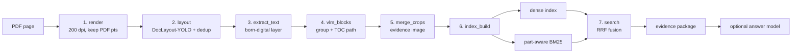

# Layout-Aware-Retrieval

**Page-Native Layout Regions as a Verifiable Retrieval Unit for Engineering Datasheets**

A retrieval pipeline for layout-bearing technical documents. The unit of retrieval
is a group of detected layout elements that a human reads as one thing — a table
with its caption and footnote, a figure with its annotations — rather than a
fixed-length token window. Every retrieved unit carries the document, page, and
PDF-point coordinates needed to check it against the source page.

[](https://github.com/zzkws/Layout-Aware-Retrieval/actions/workflows/ci.yml)
[](https://github.com/zzkws/Layout-Aware-Retrieval/releases)
[](pyproject.toml)
[](LICENSE)

Zikang Zhou · Xiamen University · 2026

---

## Abstract

Engineering datasheets are **layout-bearing** documents: a load-capacitance value
means what it means because of the table row it occupies, the part-number column
heading above it, and the note printed beneath the table. Chunking such a page into
fixed-length token windows discards precisely the structure that carries the
meaning, and with it the reader's ability to check an answer against the page it
came from.

This repository implements a pipeline whose retrieval unit is a **page-native
layout region**: a group of detected layout elements, grouped as a human would read
them, that keeps its original page geometry. Document identity, page number,
per-element PDF-point bounding boxes, the born-digital text layer, a section path,
and a rendered evidence image travel together as a single inspectable record — the
**evidence package**. Retrieval is dual-path: a multilingual dense index over a
hierarchically composed text field is fused with a part-number-aware BM25 index by
Reciprocal Rank Fusion.

Three design decisions distinguish the implementation from a naive one, and each is
argued from a failure it prevents rather than from a benchmark:

1. **PDF points are the authoritative coordinate**, pixels are derived. Render
   resolution can change without invalidating any stored evidence.
2. **Detector de-duplication ranks by area, not confidence.** YOLO routinely assigns
   *lower* confidence to the box containing more content; ranking by confidence
   silently truncates evidence.
3. **Fusion operates on ranks, not scores.** Dense cosine similarity and BM25 scores
   are not on a comparable scale, so rank fusion lets the embedding model be
   replaced without re-tuning a fusion weight.

The system has **not** been quantitatively evaluated. The protocol that would
evaluate it — query strata, region-level annotation scheme, evidence-quality
metrics, ablations, baselines, and threats to validity — is pre-registered in
[`docs/EVALUATION.md`](docs/EVALUATION.md) and contains no results. No benchmark
accuracy, no state-of-the-art claim, and no claim of superiority over pixel-based
document retrieval (Faysse et al., 2024) or any other system is made here.

---

## Method

### Pipeline



Stages 1–6 are offline. Stage 7 is the only path exercised at query time, and it
requires **no API key, no GPU, and no cloud call**.

### The evidence package

The contract between retrieval and everything downstream is a record, not an opaque
model response:

```
chunk_id · doc_id · source_pdf · page · bboxes_pdf[]
block_type · section_title · toc_path
native_text · description · crop_images[]
```

Two properties make it worth naming. First, **every field is inspectable**: a result
can be replayed against the source PDF without trusting the system that produced it.
Second, **every field survives replacement** of the layout detector, the embedding
model, the fusion strategy, or the answer model. That stability is why the same
contract is served over three surfaces — the local Python pipeline, the static
demonstration sites, and the MCP server — without being re-implemented for each.

`bboxes_pdf` is a **list**, not a union rectangle. Each member element keeps its own
box and its own crop. A union would be cheaper to store and would make region-level
IoU look better by inflating the returned area; keeping the members separate is what
makes the evidence-quality metrics in [`docs/EVALUATION.md`](docs/EVALUATION.md) §5.2
meaningful rather than self-serving.

### Coordinate contract

Each element carries two coordinate systems:

| Field | Basis | Role |
| :--- | :--- | :--- |
| `bbox_pdf` | PDF points (72 dpi) | **Authoritative.** Independent of render resolution. |
| `bbox_px` | rendered-page pixels | Derived, disposable. Cropping and visualization only. `bbox_px = bbox_pdf × dpi / 72` |

Pages render at `RENDER_DPI = 200`. Because the authoritative coordinate is
resolution-independent, the render DPI can be raised for better detection or lowered
for speed without invalidating a single stored evidence record.

### Layout detection and de-duplication

Detection uses DocLayout-YOLO (Zhao et al., 2024) with `DocStructBench` weights,
`imgsz = 1024`, `conf = 0.25`, over the 10-class DocStructBench label set. The raw
output contains two kinds of duplicate: co-located double boxes on one element, and
same-class nesting where a large region also yields a smaller box inside it.

De-duplication is a greedy pass sorted by **area descending, then confidence
descending**, with three drop rules:

| Condition | Rule |
| :--- | :--- |
| Any class, `IoU > 0.85` | keep the larger box |
| Same class, `IoU > 0.55` | keep the larger box |
| Same class, ≥ 85% of the smaller box lies inside the larger | keep the larger box |

**Why area rather than confidence.** This is the one rule most likely to look
arbitrary and is in fact the most load-bearing. YOLO frequently assigns *lower*
confidence to the box that contains more content. In document `6u`, the
`table_footnote` region yields a complete box at confidence 0.37 and a truncated box
at 0.73. Confidence-ranked de-duplication keeps the truncated box and silently cuts
off the beginning of the Note line — a failure that produces no error, no warning,
and a plausible-looking result. Area-ranked de-duplication keeps the box that
preserves more of the source.

**Cross-class nesting is deliberately preserved.** A `plain_text` box inside a
`figure` is usually real annotation content, not a duplicate. Resolving it is a
*grouping* decision, not a *detection* decision, so it is deferred to stage 4.

### Page-native grouping

A chunk is not a token window; it is the set of layout elements a human would read
as one unit. Grouping, section titles, and TOC paths are produced by a three-pass
offline VLM stage (`GEMINI_MODEL`, default `gemini-2.5-flash`) and then **frozen
into the index**:

| Pass | Scope | Produces |
| :--- | :--- | :--- |
| 1 | per document | document summary card and document name (the TOC root) |
| 2 | per page | element → chunk grouping, plus a description per chunk |
| 3 | per document | a table of contents induced from the chunks in reading order, and a `toc_path` for each chunk |

The VLM is an *offline enrichment step*, not a query-time dependency. Retrieval
never calls it.

### Dual-path indexing

The two paths deliberately index **different text compositions**, because they fail
in different ways.

**Dense path.** `embed_text` concatenates, in this order, truncated to 1500
characters:

```
toc_path → section_title → description → native_text
```

The ordering encodes a hierarchy: the TOC path says *where* the content sits, the
section title says *what* it is, and only then come the semantic summary and the raw
text. Front-loading location and identity means truncation degrades the tail — raw
text — rather than the context that makes the chunk findable at all.

Embeddings come from `microsoft/harrier-oss-v1-0.6b` (multilingual, 1024-dim) via
sentence-transformers, using the model's built-in `web_search_query` prompt on the
query side and no prompt on the document side. Vectors are L2-normalized at
encoding time, so the dot product used at query time *is* cosine similarity. A
lighter `fastembed` / `bge-small-en-v1.5` route exists as a fallback backend.

**Sparse path.** `fts_text` is a deliberately wider bag: section title, TOC path,
native text, description, keywords, and document-card words. Recall matters more
than precision on this path, because RRF arbitrates afterwards.

#### Part-number-aware tokenization

This is the most datasheet-specific decision in the system. A standard tokenizer
splits `7M-26.000MAAJ-T` into `7 / M / 26 / 000 / MAAJ / T`, which destroys
part-number search — the dominant query type for this corpus.

A token is treated as part-like when it matches
`^(?=.*\d)[a-z0-9][a-z0-9.\-_/±]{4,}$` — long, contains a digit, contains
separators. Part-like tokens are indexed through **three channels**:

| Channel | Recovers |
| :--- | :--- |
| the intact token | exact match |
| alphanumeric subfields | partial recall — the user remembers part of the number |
| character 3-grams, separators stripped | substring match — e.g. `26.000M` alone |

Ordinary words take the normal lowercase path. See
[`common/tokenize.py`](common/tokenize.py).

#### BM25

Textbook Okapi BM25 with `K1 = 1.5`, `B = 0.75`, and

```
idf = ln(1 + (N − df + 0.5) / (df + 0.5))
```

The inverted index and document lengths are precomputed; **scoring happens at query
time**, so `K1`, `B`, and `RRF_K` can be changed without rebuilding the index. That
is what makes ablation A9 in the evaluation protocol cheap enough to actually run.

### Rank fusion

Fusion is Reciprocal Rank Fusion (Cormack et al., 2009) with `RRF_K = 60`, over the
**full** ranked list from each path:

```
score(d) = Σ_paths  1 / (RRF_K + rank_path(d) + 1)
```

RRF is chosen over score-weighted fusion because dense cosine similarity and BM25
scores are not on a comparable scale, and BM25 scores in particular vary with query
length and corpus statistics. Using ranks makes fusion invariant to both — which
means the embedding model can be swapped without re-tuning a fusion weight.

Results retain `dense_rank`, `bm25_rank`, `dense_score`, and `bm25_score` alongside
the fused score, so any ranking can be attributed to a path after the fact.
`TOP_K = 15` by default.

---

## Evaluation status

**No quantitative evaluation has been run.** The design rationales above are
engineering arguments supported by individual observed cases; they are not
experimental findings, and this section exists so that they are not read as such.

What the current release demonstrates is design, implementation, and qualitative
behavior on two real corpora. [`docs/EVALUATION.md`](docs/EVALUATION.md) specifies
the protocol that *would* produce results — 150 stratified queries per corpus,
region-level ground truth, ranking and evidence-quality metrics, nine ablations,
three baselines — and contains no numbers. Publishing the protocol before the
results is deliberate: it fixes the metrics and the ablation set in advance, which
is what prevents a favourable subset from being selected after the fact.

Each design claim is assigned the ablation that would falsify it:

| | Claim | Argued above | Falsified by |
| :--- | :--- | :--- | :--- |
| **C1** | PDF-point geometry is the right authoritative coordinate; pixels are derived. | Coordinate contract | — (design invariant, not an empirical claim) |
| **C2** | Area-first de-duplication preserves evidence that confidence-first truncates. | Layout de-duplication | **A8** — should move *evidence sufficiency* while leaving ranking metrics roughly unchanged. If it does not, the rule is not earning its place. |
| **C3** | Page-native grouping yields a unit that can be scored on evidence-quality metrics a token-window baseline cannot be scored on. | Page-native grouping | Baselines B1–B3 |
| **C4** | Part-aware tokenization is necessary for the dominant query type of this corpus. | Tokenization | **A4, A5** |
| **C5** | Rank fusion makes the system robust to embedding-model replacement without re-tuning. | Rank fusion | **A1–A3, A9** |

---

## Demonstrations

| Corpus | Documents | Pages | Page-native chunks | Live demo |
| :--- | ---: | ---: | ---: | :--- |
| TXC | 108 | 226 | 875 | [TXC demo](https://evidence-rag-txc.zzkws.chatgpt.site) |
| TKD | 74 | 112 | 547 | [TKD demo](https://evidence-rag-tkd.zzkws.chatgpt.site) |

Both are crystal / oscillator datasheet collections, frozen at release
[`v0.1.0`](https://github.com/zzkws/Layout-Aware-Retrieval/releases/tag/v0.1.0).

The public sites preserve the original demonstration structure — corpus overview,
search-result presentation, chunk browser, document tree, and evidence dialogue
page — and run from versioned **static snapshots**: no Python service, no GPU, no
API key, no cloud model call.

What the hosted pages do and do not exercise is worth stating precisely, because
"static demo" usually means a recording:

- **Live, in-browser BM25.** The inverted index ships with the snapshot and is
  scored client-side, so queries are answered for real rather than replayed from a
  fixture. Results carry their true `bm25_rank` and `bm25_score`.
- **Static evidence.** Chunk records, crops, and merged evidence images are served
  as files; each result still resolves to its document, page, and bounding boxes.
- **Not exercised:** dense retrieval and RRF fusion (results report
  `dense_rank: "offline"`), corpus ingestion, and answer generation. Those remain
  local-pipeline capabilities.

The demonstration interface is in Chinese; the pipeline, the evidence contract, and
this documentation are in English.

---

## Repository layout

```
Layout-Aware-Retrieval/
├── config.py                        # corpus profiles, coordinate + model constants
├── evidence_service.py              # query-time retrieval, fusion, package assembly
├── evidence_mcp_server.py           # MCP surface over the evidence contract
├── run_full_corpus.py               # resumable whole-corpus orchestration
├── common/
│   ├── tokenize.py                  # part-number-aware tokenizer (3 channels)
│   ├── embedder.py                  # lazy singleton over st / fastembed backends
│   └── draw.py                      # overlay rendering for layout inspection
├── pipeline/
│   ├── render.py                    # 1. PDF → page images, PDF-point metadata
│   ├── layout.py                    # 2. DocLayout-YOLO detection + area-first dedup
│   ├── extract_text.py              # 3. born-digital text layer per element
│   ├── vlm_blocks.py                # 4. grouping, descriptions, TOC paths
│   ├── merge_crops.py               # 5. one readable evidence image per chunk
│   ├── index_build.py               # 6. dense + BM25 index construction
│   └── search.py                    # 7. dual-path recall + RRF fusion
├── docs/
│   ├── METHOD.md                    # design decisions and their reasoning
│   └── EVALUATION.md                # pre-registered protocol, no results
├── webapp/                          # local demo: stdlib HTTP server + 4 pages
├── sites/{txc,tkd}-demo/            # static public deployments of the same pages
├── tools/                           # public export, disclosure scan, release packaging
└── tests/                           # core behavior and public-data contract tests
```

---

## Getting started

### 1. Environment

Python 3.11–3.12.

```bash
git clone https://github.com/zzkws/Layout-Aware-Retrieval.git
cd Layout-Aware-Retrieval
python -m venv .venv
pip install -e ".[embedding,mcp]"
```

`[embedding,mcp]` is enough to *query* an existing index. Rebuilding an index from
PDFs additionally needs `[pipeline]`, which pulls in DocLayout-YOLO.

### 2. Data

Download the public corpus snapshot from release
[`v0.1.0`](https://github.com/zzkws/Layout-Aware-Retrieval/releases/tag/v0.1.0) and
restore it under `corpora/txc` or `corpora/tkd`.

`v0.1.0` is the corpus snapshot release and is the canonical data reference; later
tags are code-only. **Any reported result must pin the data to this tag** —
retrieval scores are not comparable across corpus revisions. See
[`docs/EVALUATION.md`](docs/EVALUATION.md) §9 for the full reporting rules.

### 3. Retrieve

```bash
RAG_CORPUS=tkd python -m pipeline.search "32.768 kHz load capacitance"
```

PowerShell:

```powershell
$env:RAG_CORPUS = "tkd"
python -m pipeline.search "32.768 kHz load capacitance"
```

Each result prints its fused score, both path ranks, the block type, the page, and
the source PDF path with bounding-box count — enough to open the PDF and check it.

### 4. Rebuild an index from PDFs

Each stage takes `--docs <doc_id> ...` and defaults to `config.DEMO_DOCS`:

```bash
python -m pipeline.render --docs 6u 7m
python -m pipeline.layout --docs 6u 7m
python -m pipeline.extract_text --docs 6u 7m
python -m pipeline.vlm_blocks --docs 6u 7m
python -m pipeline.merge_crops --docs 6u 7m
python -m pipeline.index_build --docs 6u 7m
```

`render`, `merge_crops`, and `index_build` also accept `--all`. For a whole corpus,
prefer the resumable runner, which skips every document whose artifacts already
exist:

```bash
python -X utf8 -u run_full_corpus.py
```

Stage 4 requires `GEMINI_API_KEY`. Stages 1–3 and 5–7 do not.

### 5. Serve the local demonstration

```bash
python webapp/server.py
```

A standard-library HTTP server with no additional dependencies, serving the corpus
overview, search, chunk browser, document tree, and evidence dialogue pages.

### 6. Agent interface (MCP)

The MCP server exposes a deliberately small, evidence-oriented surface —
`build_evidence_package`, `get_chunk`, `get_evidence_image` — so an agent can request
evidence without depending on the internal indexing implementation.

```bash
python evidence_mcp_server.py
```

---

## Configuration reference

### Environment variables

Read from the environment only, never from a checked-in file. See
[`.env.example`](.env.example).

| Key | Default | Meaning |
| :--- | :--- | :--- |
| `RAG_CORPUS` | `txc` | Corpus profile, `txc` or `tkd`. Selects source directory, data directory, manufacturer label, and demo document list. |
| `RAG_SOURCE_DIR` | `corpora/<corpus>/pdf` | Source PDF directory. |
| `RAG_DATA_DIR` | `corpora/<corpus>/data` | Pipeline output root: `pages/`, `layout/`, `blocks/`, `descriptions/`, `index/`. |
| `RAG_EMBED_BACKEND` | `st` | `st` = sentence-transformers with `harrier-oss-v1-0.6b`; `fastembed` = ONNX `bge-small-en-v1.5` fallback. |

Everything below is optional. Unset means retrieval-only, which is the default and
the public configuration.

| Key | Used by | Meaning |
| :--- | :--- | :--- |
| `GEMINI_API_KEY` | stage 4 only | Offline grouping and description enrichment. Never read at query time. |
| `GEMINI_MODEL` | stage 4 only | Default `gemini-2.5-flash`. |
| `RAG_LLM_BASE_URL` / `_MODEL` / `_API_KEY` | webapp | OpenAI-compatible multimodal service for answer generation over retrieved evidence. |
| `RAG_REWRITE_BASE_URL` / `_MODEL` / `_API_KEY` | webapp | Optional query rewriting. Falls back to the `RAG_LLM_*` values. |

### Source constants

Not environment-driven — edit the file. Grouped here because these are the values
an ablation would vary.

| Constant | Value | Defined in | Meaning |
| :--- | :--- | :--- | :--- |
| `RENDER_DPI` | `200` | `config.py` | Render resolution. Affects detection quality and crop legibility only — **not** stored geometry. |
| `LAYOUT_IMGSZ` / `LAYOUT_CONF` | `1024` / `0.25` | `config.py` | DocLayout-YOLO inference size and confidence floor. |
| `RRF_K` | `60` | `config.py` | Fusion constant. Larger values flatten the contribution of top ranks. |
| `TOP_K` | `15` | `config.py` | Results returned after fusion. |
| `K1`, `B` | `1.5`, `0.75` | `pipeline/search.py` | BM25 parameters. Applied at query time, so changing them needs no rebuild. |

No key is read from a file; all are read from the environment, and the public
snapshot is checked for leaked credentials in CI (`tools/scan_public.py`).

---

## Implementation notes

Points that separate this implementation from a naive one. The first three are
silent-correctness issues — they produce plausible output when wrong, which is why
they are documented rather than left to inspection.

1. **Area-first de-duplication.** Confidence-first ranking truncates evidence
   without raising anything. See *Layout detection and de-duplication* above.

2. **A vertical-discontinuity guard on grouping.** If the VLM groups elements that
   are separated by more than 18% of the page height — the classic failure being a
   running header merged with a footer — the group is split into vertically
   contiguous sub-groups, and the description stays with the largest one. Without
   this, one chunk's `bboxes_pdf` spans the whole page and the evidence image is
   two unrelated strips.

3. **Figure- and table-bearing chunks are never dropped.** A chunk with an empty
   `toc_path` is normally treated as index-functional (headers, page numbers) and
   excluded. A chunk containing a `figure` or `table` is exempt: if the VLM returns
   an empty path for it, the path falls back to the document root instead. The
   failure this prevents is losing exactly the content the system exists to
   retrieve.

4. **Elements the VLM fails to assign are recovered, not discarded.** Any element
   not placed in a group becomes a single-element chunk, with a warning. Silent
   element loss would be invisible downstream.

5. **Crop and overlay directories are cleared per document per run.** Otherwise a
   re-run leaves stale images from a previous grouping alongside the new ones, and
   the evidence image no longer corresponds to the stored boxes.

6. **BM25 scoring is deferred to query time.** Only postings and document lengths
   are persisted, so ranking parameters change without an index rebuild.

7. **Evidence images are composed without rescaling, and downscaled by width only.**
   `merge_crops` stacks member crops in reading order at native pixel size — canvas
   width = widest member, 12 px white separators — so all crops from one render
   share a PPI. Where the web server must shrink an image before sending it to a
   model, it constrains **width** rather than the longest edge: a merged chunk image
   is a tall narrow strip, and fitting it to a longest-edge budget crushes table
   text into illegibility.

8. **Retrieval is serialized behind a lock in the web server.** `fastembed`
   inference is not thread-safe, and the failure mode under concurrency is wrong
   vectors rather than an exception.

9. **The corpus runner is resumable and quota-aware.** Each stage skips documents
   whose artifacts exist. Sustained Gemini quota failures (`429`,
   `RESOURCE_EXHAUSTED`) stop the VLM stage gracefully, index what completed, and
   resume from that point on the next run. Log markers `[stage]` / `[vlm-ok]` /
   `[QUOTA-STOP]` / `[FATAL]` / `[ALL-DONE]` are a stable monitoring contract.

---

## Limitations and validity

Stated plainly, because they bound what this repository supports.

- **No results.** Nothing here has been measured. Every rationale is an engineering
  argument, several of them supported by a single observed document.
- **No OCR.** Scanned PDFs do not pass through a dedicated OCR engine; the pipeline
  assumes a born-digital text layer. Regions backed by embedded images or vector
  curves have empty `native_text`, and their semantics rest entirely on the VLM
  description.
- **No cell-level table structure.** Tables are retrieved as regions, not parsed
  into cells, so a query resolving to one cell returns the whole table.
- **No cross-page table joining.** A table continued across a page break stays two
  chunks.
- **Grouping quality is bounded by one frozen VLM pass.** Descriptions and TOC paths
  came from one model at one point in time; regenerating them changes the index, and
  any result must therefore name the snapshot it was computed on.
- **Rank fusion over full lists.** Both paths rank every chunk, so documents with a
  BM25 score of zero still receive a rank and contribute a small amount of fused
  mass. The contribution is bounded by `1/(RRF_K + N)` and is negligible at this
  corpus size, but it is not zero, and it makes fused scores dependent on corpus
  size in a way raw BM25 is not.
- **Single domain.** Both corpora are crystal / oscillator datasheets from adjacent
  vendors. Nothing here is shown to generalize to other document families.
- **Single author.** Design, implementation, and any future query authoring and
  annotation share one person; expectancy bias is not controlled for.
- **Data rights are separate from code rights.** Redistribution of the underlying
  datasheets is not granted by the Apache-2.0 licence on the code.

---

## Open work

- Run the pre-registered protocol in [`docs/EVALUATION.md`](docs/EVALUATION.md) and
  report A8 first — it is the ablation that decides whether the area-first rule is
  earning its place.
- Cell-level table parsing, so that a parametric query can resolve to a row rather
  than a table.
- Cross-page table joining, which the current chunk model has no representation for.
- An OCR path for scanned datasheets, which would also widen the query set the
  protocol can cover.
- A second document family, to test whether anything here survives outside crystal
  and oscillator datasheets.

---

## Citation

```bibtex
@software{zhou2026layoutaware,
  author  = {Zhou, Zikang},
  title   = {Layout-Aware-Retrieval: Page-Native Layout Regions as a
             Verifiable Retrieval Unit for Engineering Datasheets},
  year    = {2026},
  version = {0.1.2},
  url     = {https://github.com/zzkws/Layout-Aware-Retrieval},
  license = {Apache-2.0}
}
```

Machine-readable metadata is in [`CITATION.cff`](CITATION.cff).

## Acknowledgements

- [DocLayout-YOLO](https://github.com/opendatalab/DocLayout-YOLO) (OpenDataLab) for
  the layout detector and the `DocStructBench` weights.
- [PyMuPDF](https://pymupdf.readthedocs.io/) for PDF rendering and text-layer
  extraction with faithful coordinates.
- [sentence-transformers](https://www.sbert.net/) and
  [fastembed](https://github.com/qdrant/fastembed) for the embedding backends.

## References

- Cormack, G. V., Clarke, C. L. A., & Buettcher, S. (2009). *Reciprocal Rank Fusion
  Outperforms Condorcet and Individual Rank Learning Methods.* SIGIR, 758–759.
- Faysse, M., et al. (2024). *ColPali: Efficient Document Retrieval with Vision
  Language Models.* arXiv:2407.01449.
- Järvelin, K., & Kekäläinen, J. (2002). *Cumulated Gain-Based Evaluation of IR
  Techniques.* ACM Transactions on Information Systems, 20(4), 422–446.
- Lewis, P., et al. (2020). *Retrieval-Augmented Generation for Knowledge-Intensive
  NLP Tasks.* NeurIPS.
- Robertson, S., & Zaragoza, H. (2009). *The Probabilistic Relevance Framework: BM25
  and Beyond.* Foundations and Trends in Information Retrieval, 3(4), 333–389.
- Xu, Y., Li, M., Cui, L., Huang, S., Wei, F., & Zhou, M. (2020). *LayoutLM:
  Pre-training of Text and Layout for Document Image Understanding.* KDD.
- Zhao, Z., Kang, H., Wang, B., & He, C. (2024). *DocLayout-YOLO: Enhancing Document
  Layout Analysis through Diverse Synthetic Data and Global-to-Local Adaptive
  Perception.* arXiv:2410.12628.

## License

Released under the [Apache-2.0 License](LICENSE). The underlying datasheets and
third-party artifacts carry their own terms — see [DATA_NOTICE.md](DATA_NOTICE.md)
and [THIRD_PARTY_NOTICES.md](THIRD_PARTY_NOTICES.md). Security reports should follow
[SECURITY.md](SECURITY.md).
