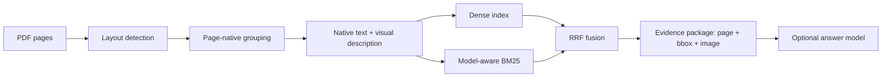

# Evidence RAG Pilot

**A traceable, page-native RAG prototype for engineering datasheets.**
**面向工程数据手册的可追溯、版面级 RAG 技术原型。**

Evidence RAG Pilot is a public demonstration of my document-AI and RAG engineering work. It is designed to make the pipeline inspectable: a retrieved claim can be traced to a document, page, PDF bounding box, native text, and evidence image.

这个项目主要用于展示我的文档 AI 与 RAG 工程设计。它不把 PDF 简化为脱离版面的 token 片段，而是让检索结果保留文档、页码、PDF 坐标、原文和证据图，从而可以检查“答案依据到底在哪里”。

> This is a technical prototype and portfolio project, not a claim of state-of-the-art performance or superiority over Pixel RAG or other systems. The published metrics cover retrieval only; end-to-end answer quality has not yet been benchmarked.

## What the demo proves / 演示重点

- **Page-native chunks:** tables, figures, captions, drawings, and text regions remain tied to page geometry.
- **Traceable evidence:** every result carries page, table-of-contents path, PDF-space boxes, text, and a merged evidence image.
- **Hybrid retrieval:** the local pipeline combines multilingual dense retrieval with model-number-aware BM25 through reciprocal-rank fusion (RRF).
- **Reusable evidence API:** MCP tools expose evidence packages without coupling downstream agents to the indexing implementation.
- **Honest public deployment:** the two public sites run deterministic BM25 in the browser; they do not pretend to run the full Python, embedding, or multimodal generation stack.

## Public demos / 在线演示

| Corpus | Documents | Pages | Chunks | Demo |
|---|---:|---:|---:|---|
| TXC | 108 | 226 | 875 | [Open the TXC demo](https://evidence-rag-txc.zzkws.chatgpt.site) |
| TKD | 74 | 112 | 547 | [Open the TKD demo](https://evidence-rag-tkd.zzkws.chatgpt.site) |

The public deployments preserve the structure and visual design of the original TXC/TKD demos: corpus overview, search results, chunk browser, document tree, and evidence-dialog page. They read versioned static snapshots only; no Python service, API key, GPU, or cloud model is required.

公开部署保留原始 TXC/TKD Demo 的页面结构与视觉：语料概览、检索结果、Chunk 浏览、文档目录树和证据对话页。站点只读取随版本发布的静态快照，不依赖 Python 服务、API Key、GPU 或云端模型。

## Architecture / 技术原理



The central interface is the **evidence package**, not a model response. Retrieval and generation can change while the traceability contract stays stable.

核心接口是**证据包**而不是某个模型的答案。检索模型或生成模型可以替换，但证据的文档、页码、坐标、原文和图片契约保持稳定。

## Quick start / 快速开始

Python 3.11–3.12 is supported.

```bash
git clone https://github.com/zzkws/evidence-rag-pilot.git
cd evidence-rag-pilot
python -m venv .venv
# Windows: .venv\Scripts\activate
# macOS/Linux: source .venv/bin/activate
pip install -e ".[embedding,mcp]"
```

Download the public data snapshot after `v0.1.0` is published:

```bash
gh release download v0.1.0 --repo zzkws/evidence-rag-pilot --pattern "*.zip" --pattern "SHA256SUMS.txt"
```

Extract either corpus to `corpora/txc/data` or `corpora/tkd/data`, then run retrieval:

```bash
RAG_CORPUS=tkd python -m pipeline.search "32.768 kHz load capacitance"
```

PowerShell:

```powershell
$env:RAG_CORPUS = "tkd"
python -m pipeline.search "32.768 kHz load capacitance"
```

The repository intentionally excludes model weights and full generated data from Git history. Release archives include SHA-256 checksums; model weights are downloaded from their official sources.

## Operating profiles / 模型与硬件需求

| Profile | Retrieval | Generation | Practical requirement |
|---|---|---|---|
| Public Sites | Browser BM25 | Reviewed static examples | No GPU, no API key |
| Local lite | BGE-small or Harrier | Optional/off | CPU, 8–16 GB RAM |
| Full pipeline | Harrier 0.6B + BM25 + RRF | OpenAI-compatible multimodal model | GPU recommended; for a 12B BF16 service, plan for at least 32 GB and preferably 48 GB VRAM |

Offline page grouping and description generation use `GEMINI_API_KEY`. Online answer generation is optional and configured through generic OpenAI-compatible environment variables; retrieval works without it. See [.env.example](.env.example).

## Reproducible baseline / 可复现基线

The current TKD seed set contains 12 questions; 10 have non-empty gold evidence. The saved dense+BM25/RRF baseline is:

| Metric | Result |
|---|---:|
| Recall@5 | 0.6583 |
| Recall@15 | 0.8917 |
| MRR@15 | 0.6167 |

These values are regression baselines, not production acceptance thresholds. The project does **not** publish an answer-accuracy claim because the existing answer-result files are empty.

Re-run:

```bash
python -m tools.evaluate_retrieval \
  --corpus tkd --data-dir corpora/tkd/data \
  --input eval/seed_eval.jsonl \
  --output eval/retrieval_baseline.json
```

## Pipeline / 完整处理流程

1. `pipeline.render` — render PDF pages while preserving PDF-point coordinates.
2. `pipeline.layout` — detect and de-duplicate page elements with DocLayout-YOLO.
3. `pipeline.extract_text` — recover the born-digital text layer per element.
4. `pipeline.vlm_blocks` — group elements, build descriptions, and assign TOC paths.
5. `pipeline.merge_crops` — create one readable evidence image per chunk.
6. `pipeline.index_build` — build dense and BM25 indexes.
7. `pipeline.search` — retrieve and fuse ranks with RRF.

Every stage supports targeted document runs; `run_full_corpus.py` orchestrates resumable full-corpus processing.

## Evidence MCP

The MCP server keeps its small public contract:

- `build_evidence_package`
- `get_chunk`
- `get_evidence_image`

```bash
pip install -e ".[embedding,mcp]"
python evidence_mcp_server.py
```

## Repository map

```text
common/                 tokenization, drawing, embedding adapter
pipeline/               PDF-to-index processing stages
tools/                  public export, evaluation, release packaging
tests/                  unit tests for retrieval and public-data contracts
sites/txc-demo/         TXC public technical demo
sites/tkd-demo/         TKD public technical demo
docs/project-analysis.md bilingual technical analysis and model report
eval/                   seed questions and reproducible retrieval baseline
```

## Known limits / 已知边界

- Scanned PDFs do not yet use a dedicated OCR engine.
- Tables are not cell-structured and continued tables are not automatically joined across pages.
- The evaluation set is small and TKD-focused.
- The public sites run BM25 only; full dense+BM25/RRF remains a local pipeline.
- Datasheet redistribution rights remain separate from the Apache-2.0 code license.

Read the full [bilingual technical analysis](docs/project-analysis.md), [data notice](DATA_NOTICE.md), and [third-party notices](THIRD_PARTY_NOTICES.md).

## Contributing and security

Contributions are welcome through focused pull requests. See [CONTRIBUTING.md](CONTRIBUTING.md). Please report sensitive issues according to [SECURITY.md](SECURITY.md) rather than opening a public issue.

## License and citation

Original source code is licensed under [Apache-2.0](LICENSE). Data and third-party artifacts retain their own terms; see [DATA_NOTICE.md](DATA_NOTICE.md).

If this prototype helps your work, cite the repository and release:

```text
zzkws. Evidence RAG Pilot: a traceable, page-native RAG prototype for engineering datasheets. v0.1.0.
https://github.com/zzkws/evidence-rag-pilot
```
