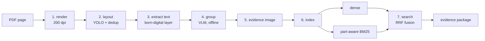

# Layout-Aware-RAG

**Layout-Aware RAG for Engineering Datasheets**

A RAG demo for documents where the layout carries the meaning. Instead of cutting
pages into fixed-length token windows, it retrieves *page-native layout regions* —
a table with its caption and footnote, a figure with its annotations — and every
result comes back with the document, page, and PDF coordinates you need to check it
against the original page.

[](https://github.com/zzkws/Layout-Aware-RAG/actions/workflows/ci.yml)
[](https://github.com/zzkws/Layout-Aware-RAG/releases)
[](pyproject.toml)
[](LICENSE)

Zikang Zhou · Xiamen University · 2026

---

## Live demos

Two real datasheet corpora, searchable in the browser. No account, no API key, and
nothing to install.

| Corpus | Documents | Pages | Chunks | |
| :--- | ---: | ---: | ---: | :--- |
| **TXC** — crystals, oscillators, TCXO/VCXO/OCXO | 108 | 226 | 875 | **[▶ Open the TXC demo](https://evidence-rag-txc.zzkws.chatgpt.site)** |
| **TKD** — crystals and oscillator modules | 74 | 112 | 547 | **[▶ Open the TKD demo](https://evidence-rag-tkd.zzkws.chatgpt.site)** |

Each demo ships one-click example queries. Representative cases:

- **Part number, whole or partial** — `7M 26.000MHz load capacitance ESR`, or only
  the fragment a user recalls. A standard tokenizer splits these into `7 / M / 26 /
  000`; this one indexes them intact, as subfields, and as character 3-grams.
- **Parameter lookup** — `32.768 kHz crystal load capacitance`,
  `VCXO 3.3V phase jitter package`. Hits resolve to the table region holding the
  value, rather than to a text window that merely contains the words.
- **Drawing or footprint query** — `package dimensions land pattern`,
  `pin connection tri-state output`, where the answer is a figure rather than
  prose.
- **Any result, opened.** Each hit carries its document, page number, and bounding
  boxes; the **evidence image** — the crop of that page region — is bundled for the
  example queries above. The chunk browser and document tree show how the pages
  were segmented.

The hosted pages execute **BM25 in the browser** against an inverted index shipped
with the snapshot: every chunk is searchable and every query is scored at request
time, not replayed from a fixture. Dense retrieval, RRF fusion, and answer
generation are local-pipeline capabilities and are reported as `offline` in the
results. Evidence images are pre-rendered for the example queries rather than for
all 875 / 547 chunks, which holds each snapshot to a few megabytes instead of
several hundred; running the pipeline locally produces an image for every hit.

> The demo interface is in Chinese; the pipeline, the code, and these docs are in
> English.

---

## The problem

Engineering datasheets are layout-bearing. A load-capacitance value means what it
means because of the table row it sits in, the part-number column heading above it,
and the note printed under the table. Flatten that page into 512-token windows and
you destroy the structure that carried the meaning — and the reader's ability to
check the answer.

So the retrieval unit here is not a token window. It is a group of detected layout
elements that a human would read as one thing, and it keeps its page geometry all
the way through to the result.

---

## How it works



| # | Stage | What it does |
| ---: | :--- | :--- |
| 1 | `render` | Rasterize pages at 200 dpi, keeping PDF-point coordinates. |
| 2 | `layout` | DocLayout-YOLO detects tables, figures, captions, text; duplicate boxes are removed. |
| 3 | `extract_text` | Pull the born-digital text layer for each element. |
| 4 | `vlm_blocks` | Group elements into chunks; attach a description and a TOC path. Offline. |
| 5 | `merge_crops` | Stack each chunk's crops into one readable evidence image. |
| 6 | `index_build` | Build the dense and BM25 indexes. |
| 7 | `search` | Retrieve from both paths, fuse with RRF. |

Stages 1–6 are offline. Only stage 7 runs at query time, and it needs **no API key,
no GPU, and no network**.

### The evidence package

Every result is a record, not an opaque model response:

```
chunk_id · doc_id · source_pdf · page · bboxes_pdf[]
block_type · section_title · toc_path
native_text · description · crop_images[]
```

You can replay any hit against the source PDF without trusting the system that
produced it. And because the fields are stable, the layout detector, embedding
model, fusion strategy, or answer model can all be swapped without breaking
anything downstream — which is why the same contract serves the Python pipeline,
the demo sites, and the MCP server without being reimplemented three times.

`bboxes_pdf` is a **list**, not a union rectangle: each member element keeps its own
box and its own crop.

### Four decisions worth explaining

**1. PDF points are the stored coordinate, pixels are derived.** `bbox_pdf` is
authoritative; `bbox_px = bbox_pdf × dpi / 72` is used only for cropping. You can
re-render at a different DPI without invalidating a single stored result.

**2. Duplicate boxes are resolved by area, not confidence.** YOLO often gives the
box containing *more* content a *lower* score. In document `6u`, the complete
`table_footnote` box scores 0.37 against 0.73 for a truncated one — ranking by
confidence silently cuts off the start of the Note line, with no error and a
result that still looks fine. Ranking by area keeps the box that preserves more of
the source.

**3. Part numbers are tokenized three ways.** A standard tokenizer splits
`7M-26.000MAAJ-T` into `7 / M / 26 / 000 / MAAJ / T`, which defeats part-number
search entirely. Here a part-like token is indexed as the intact token (exact
match), as alphanumeric subfields (partial recall), and as character 3-grams
(substring match, so `26.000M` alone still retrieves it).

**4. The two paths are fused on ranks, not scores.** Dense cosine similarity and
BM25 scores are not on a comparable scale, and BM25 in particular varies with query
length and corpus statistics. RRF (`1/(k + rank)`, `k = 60`) is invariant to both,
so the embedding model can be replaced without re-tuning a fusion weight. Results keep
`dense_rank`, `bm25_rank`, and both raw scores, so any hit can be traced to the
path that produced it.

More detail — including the composition of each index, the validation guards on the
grouping stage, and the per-stage artifact formats — is in
[`docs/METHOD.md`](docs/METHOD.md).

---

## Getting started

**Install** (Python 3.11–3.12):

```bash
git clone https://github.com/zzkws/Layout-Aware-RAG.git
cd Layout-Aware-RAG
python -m venv .venv
pip install -e ".[embedding,mcp]"
```

**Get the data.** Download the corpus snapshot from release
[`v0.1.0`](https://github.com/zzkws/Layout-Aware-RAG/releases/tag/v0.1.0) and
restore it under `corpora/txc` or `corpora/tkd`. `v0.1.0` is the canonical data
reference; later tags are code-only, and retrieval results are not comparable
across corpus revisions.

**Search:**

```bash
RAG_CORPUS=tkd python -m pipeline.search "32.768 kHz load capacitance"
```

```powershell
$env:RAG_CORPUS = "tkd"
python -m pipeline.search "32.768 kHz load capacitance"
```

Each result prints its fused score, both path ranks, the block type, the page, and
the source PDF — enough to open the file and check it.

**Run the local demo** (standard-library HTTP server, no extra dependencies):

```bash
python webapp/server.py
```

**Rebuild an index from PDFs.** Every stage takes `--docs <doc_id> ...`; `render`,
`merge_crops`, and `index_build` also take `--all`:

```bash
python -m pipeline.render --docs 6u 7m
python -m pipeline.layout --docs 6u 7m
python -m pipeline.extract_text --docs 6u 7m
python -m pipeline.vlm_blocks --docs 6u 7m
python -m pipeline.merge_crops --docs 6u 7m
python -m pipeline.index_build --docs 6u 7m
```

For a whole corpus, use the resumable runner — it skips any document whose
artifacts already exist and stops gracefully if the Gemini quota runs out:

```bash
python -X utf8 -u run_full_corpus.py
```

Only stage 4 needs `GEMINI_API_KEY`.

**Use it from an agent (MCP).** The server exposes three tools —
`build_evidence_package`, `get_chunk`, `get_evidence_image` — so an agent can ask
for evidence without knowing anything about the indexing:

```bash
python evidence_mcp_server.py
```

---

## Configuration

All optional; read from the environment only. See [`.env.example`](.env.example).

| Variable | Default | Meaning |
| :--- | :--- | :--- |
| `RAG_CORPUS` | `txc` | Corpus profile: `txc` or `tkd`. |
| `RAG_SOURCE_DIR` | `corpora/<corpus>/pdf` | Source PDFs. |
| `RAG_DATA_DIR` | `corpora/<corpus>/data` | Pipeline output root. |
| `RAG_EMBED_BACKEND` | `st` | `st` = sentence-transformers (`harrier-oss-v1-0.6b`), `fastembed` = ONNX `bge-small-en-v1.5`. |
| `GEMINI_API_KEY` | — | Stage 4 only. Never read at query time. |
| `RAG_LLM_*`, `RAG_REWRITE_*` | — | Optional OpenAI-compatible answer generation and query rewriting for the webapp. Unset = retrieval only. |

Tuning constants live in [`config.py`](config.py): `RENDER_DPI` (200), `LAYOUT_CONF`
(0.25), `RRF_K` (60), `TOP_K` (15), and `K1`/`B` (1.5 / 0.75) in
[`pipeline/search.py`](pipeline/search.py). BM25 and RRF both score at query time,
so changing any of them needs no index rebuild.

---

## Repository layout

```
Layout-Aware-RAG/
├── config.py                    # corpus profiles, coordinate + model constants
├── evidence_service.py          # query-time retrieval, fusion, package assembly
├── evidence_mcp_server.py       # MCP tools over the evidence contract
├── run_full_corpus.py           # resumable whole-corpus runner
├── common/                      # part-aware tokenizer, embedding backends, drawing
├── pipeline/                    # the seven stages, one file each
├── docs/METHOD.md               # design decisions in detail
├── docs/EVALUATION.md           # what has and has not been measured
├── webapp/                      # local demo: stdlib server + 4 pages
├── sites/{txc,tkd}-demo/        # the two static public deployments
├── tools/                       # public export, disclosure scan, release packaging
└── tests/                       # core behavior and public-data contract tests
```

---

## Status and limitations

This is a **demo and design study**, not a benchmarked system. It has not been
quantitatively evaluated — the design choices above are engineering arguments and
observed cases, not measurements. No accuracy claim, no SOTA claim, and no claim of
superiority over pixel-based document RAG. [`docs/EVALUATION.md`](docs/EVALUATION.md)
records what a real evaluation would need.

Known scope limits:

- **No OCR.** Scanned PDFs are out; the pipeline assumes a born-digital text layer.
- **No cell-level tables.** A query about one cell returns the whole table region.
- **No cross-page table joining.** A table split by a page break stays two chunks.
- **Single-column reading order.** Ordering by vertical position is wrong for
  genuinely multi-column pages.
- **Grouping is frozen.** Descriptions and TOC paths came from one VLM run;
  regenerating them changes the index.
- **One document family.** Both corpora are crystal/oscillator datasheets from
  adjacent vendors.
- **Data rights are separate from code rights.** Apache-2.0 covers the code, not the
  datasheets.

---

## Built on

[DocLayout-YOLO](https://github.com/opendatalab/DocLayout-YOLO) for layout detection
(Zhao et al., 2024, arXiv:2410.12628) · [PyMuPDF](https://pymupdf.readthedocs.io/)
for rendering and text extraction · [sentence-transformers](https://www.sbert.net/)
and [fastembed](https://github.com/qdrant/fastembed) for embeddings · Okapi BM25
(Robertson & Zaragoza, 2009) and Reciprocal Rank Fusion (Cormack et al., 2009) for
retrieval and fusion.

## Citation

```bibtex
@software{zhou2026layoutawarerag,
  author  = {Zhou, Zikang},
  title   = {Layout-Aware-RAG: Layout-Aware Retrieval-Augmented Generation
             for Engineering Datasheets},
  year    = {2026},
  url     = {https://github.com/zzkws/Layout-Aware-RAG},
  license = {Apache-2.0}
}
```

Machine-readable metadata is in [`CITATION.cff`](CITATION.cff).

## License

[Apache-2.0](LICENSE) for the code. The datasheets and third-party models carry
their own terms — see [DATA_NOTICE.md](DATA_NOTICE.md) and
[THIRD_PARTY_NOTICES.md](THIRD_PARTY_NOTICES.md). Security reports:
[SECURITY.md](SECURITY.md).
