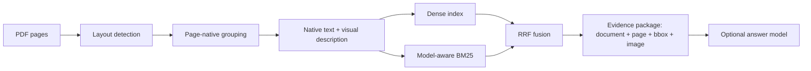

# Evidence RAG Pilot

**A page-native, traceable RAG design prototype for engineering datasheets.**
**面向工程数据手册的版面级、可追溯 RAG 技术设计原型。**

Evidence RAG Pilot is a portfolio project for showing how I designed and implemented an inspectable document-RAG pipeline. Instead of reducing a PDF to detached token windows, the system keeps document identity, page number, PDF coordinates, native text, section context, and evidence images together.

这个项目聚焦展示我的文档 AI 与 RAG 技术设计。系统不把 PDF 简化为脱离版面的文本切片，而是让文档、页码、PDF 坐标、原文、章节上下文和证据图片始终保持关联。

> **Evaluation status / 测评状态：** This project has not undergone a formal quantitative evaluation. The current release demonstrates the design, implementation, and qualitative experience; it does not claim benchmark accuracy, SOTA performance, or superiority over Pixel RAG or other systems.
> 本项目尚未进行正式的定量测评。当前版本只展示技术设计、工程实现和体验效果，不声明基准准确率、SOTA 表现或优于 Pixel RAG 等其他系统。

## Demos / 在线演示

| Corpus | Documents | Pages | Page-native chunks | Demo |
|---|---:|---:|---:|---|
| TXC | 108 | 226 | 875 | [Open TXC demo](https://evidence-rag-txc.zzkws.chatgpt.site) |
| TKD | 74 | 112 | 547 | [Open TKD demo](https://evidence-rag-tkd.zzkws.chatgpt.site) |

The public sites preserve the original demo structure: corpus overview, search-result presentation, chunk browser, document tree, and evidence-dialog page. They read versioned static snapshots and require no Python service, GPU, API key, or cloud-model call.

公开站保留原始 Demo 的页面结构：语料概览、检索结果展示、Chunk 浏览、文档目录树和证据对话页。站点读取版本化静态快照，不需要 Python 服务、GPU、API Key 或云端模型调用。

## Design focus / 技术设计重点

- **Page-native chunks / 版面级切块** — tables, figures, captions, drawings, and text regions remain tied to their original page geometry.
- **Traceable evidence / 可追溯证据** — a result can return to its document, page, TOC path, PDF bounding boxes, native text, and merged evidence image.
- **Hybrid retrieval / 混合检索** — the local pipeline combines multilingual dense retrieval with model-number-aware BM25 through reciprocal-rank fusion (RRF).
- **Stable evidence contract / 稳定证据契约** — retrieval and generation models can change without changing the downstream evidence interface.
- **Reusable MCP interface / 可复用 MCP 接口** — agents can request evidence packages without depending on the internal indexing implementation.



The central product interface is the **evidence package**, not an opaque model response. Its fields remain inspectable even when layout, embedding, ranking, or answer models are replaced.

核心产品接口是**证据包**，而不是不可检查的模型回答。即使版面模型、Embedding、排序或生成模型被替换，证据字段仍保持可检查。

## Local pipeline / 本地完整管线

Python 3.11–3.12 is supported.

```bash
git clone https://github.com/zzkws/evidence-rag-pilot.git
cd evidence-rag-pilot
python -m venv .venv
pip install -e ".[embedding,mcp]"
```

Download the full public corpus snapshot from [`v0.1.0`](https://github.com/zzkws/evidence-rag-pilot/releases/tag/v0.1.0), restore it under `corpora/txc` or `corpora/tkd`, then select a corpus with `RAG_CORPUS`.

```bash
RAG_CORPUS=tkd python -m pipeline.search "32.768 kHz load capacitance"
```

PowerShell:

```powershell
$env:RAG_CORPUS = "tkd"
python -m pipeline.search "32.768 kHz load capacitance"
```

### Processing stages / 处理阶段

1. `pipeline.render` — render PDF pages while preserving PDF-point coordinates.
2. `pipeline.layout` — detect and de-duplicate tables, figures, captions, and text regions.
3. `pipeline.extract_text` — recover the born-digital text layer per element.
4. `pipeline.vlm_blocks` — group elements and attach descriptions and TOC paths.
5. `pipeline.merge_crops` — create a readable evidence image for each chunk.
6. `pipeline.index_build` — build dense and BM25 indexes.
7. `pipeline.search` — retrieve and fuse ranked results with RRF.

`run_full_corpus.py` orchestrates resumable corpus processing. Offline VLM enrichment uses `GEMINI_API_KEY`; answer generation is optional and configured through generic OpenAI-compatible environment variables. Retrieval can run without an answer model.

## Evidence MCP

The MCP server exposes a small evidence-oriented interface:

- `build_evidence_package`
- `get_chunk`
- `get_evidence_image`

```bash
pip install -e ".[embedding,mcp]"
python evidence_mcp_server.py
```

## Repository map / 仓库结构

```text
common/                 tokenization, drawing, and embedding adapters
pipeline/               PDF-to-evidence-index processing stages
webapp/                 original local demo interface and Python server
sites/txc-demo/         static public deployment of the TXC demo
sites/tkd-demo/         static public deployment of the TKD demo
tools/                  public export, safety checks, and release packaging
tests/                  core behavior and public-data contract tests
```

## Current boundaries / 当前边界

- Scanned PDFs do not yet use a dedicated OCR engine.
- Tables are not converted into a cell-level structured representation.
- Continued tables are not automatically joined across pages.
- Public Sites display static snapshots; dense retrieval, RRF, ingestion, and optional answer generation remain local-pipeline capabilities.
- Datasheet redistribution rights remain separate from the Apache-2.0 code license.

## License and data

Original source code is licensed under [Apache-2.0](LICENSE). Dataset rights and third-party artifacts retain their own terms; see [DATA_NOTICE.md](DATA_NOTICE.md) and [THIRD_PARTY_NOTICES.md](THIRD_PARTY_NOTICES.md). Security reports should follow [SECURITY.md](SECURITY.md).
