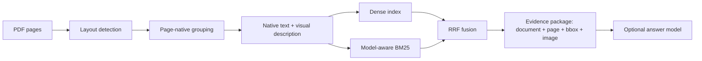

# Evidence RAG Pilot

[](https://github.com/zzkws/evidence-rag-pilot/actions/workflows/ci.yml)
[](https://github.com/zzkws/evidence-rag-pilot/releases)
[](pyproject.toml)
[](LICENSE)

**A page-native, traceable RAG design prototype for engineering datasheets.**

**面向工程数据手册的版面级、可追溯 RAG 技术设计原型。**

---

## Overview

Engineering datasheets are layout-bearing documents. A load-capacitance value means what it means because of the table row it sits in, the part-number column heading above it, and the note printed beneath the table. Flattening such a page into fixed-length token windows destroys exactly the structure that carries the meaning — and with it, the reader's ability to check the answer.

Evidence RAG Pilot keeps that structure intact. Document identity, page number, PDF coordinates, native text, section context, and evidence images travel together as a single inspectable unit. The design target is not "better answers" but a **retrieval result you can verify**: every hit can return to the exact region of the exact page it came from.

This is a portfolio project demonstrating document-AI and RAG system design.

## 概述

工程数据手册是**版面承载语义**的文档。一个负载电容值之所以有意义，取决于它所在的表格行、上方的型号列头，以及表格下方那行注释。把这样的页面压平成定长 token 窗口，恰好破坏了承载语义的结构——也一并破坏了读者复核答案的能力。

Evidence RAG Pilot 让这层结构保持完整：文档、页码、PDF 坐标、原文、章节上下文和证据图片作为一个可检查的整体一起流转。设计目标不是"更好的回答"，而是**可核验的检索结果**——每一条命中都能回到它所出自的那一页的那一块区域。

本项目用于展示我的文档 AI 与 RAG 系统设计能力。

> [!NOTE]
> **Evaluation status.** This project has not undergone a formal quantitative evaluation. The current release demonstrates design, implementation, and qualitative behavior; it does not claim benchmark accuracy, SOTA performance, or superiority over Pixel RAG or any other system. The evaluation protocol — query strata, region-level annotation scheme, evidence-quality metrics, ablations, and threats to validity — is specified in advance in [`docs/EVALUATION.md`](docs/EVALUATION.md), which contains no results.
>
> **测评状态。** 本项目尚未进行正式的定量测评。当前版本只展示技术设计、工程实现和体验效果，不声明基准准确率、SOTA 表现或优于 Pixel RAG 等任何其他系统。评测协议（查询分层、区域级标注方案、证据质量指标、消融与效度威胁）已预先写入 [`docs/EVALUATION.md`](docs/EVALUATION.md)，其中不含任何结果。

## Documentation / 文档

| Document | Contents | 内容 |
|---|---|---|
| [`docs/METHOD.md`](docs/METHOD.md) | Design decisions and the reasoning behind each: coordinate contract, layout de-duplication, page-native grouping, dual-path indexing, part-number-aware tokenization, rank fusion. | 各项设计决策及其取舍理由：坐标契约、版面去重、版面级分组、双路索引、型号感知分词、排序融合。 |
| [`docs/EVALUATION.md`](docs/EVALUATION.md) | Pre-registered evaluation protocol: task definition, query strata, annotation scheme, metrics, ablations, baselines, threats to validity. No results. | 预注册评测协议：任务定义、查询分层、标注方案、指标、消融、基线、效度威胁。不含结果。 |

## Demos / 在线演示

| Corpus | Documents | Pages | Page-native chunks | Demo |
|---|---:|---:|---:|---|
| TXC | 108 | 226 | 875 | [Open TXC demo](https://evidence-rag-txc.zzkws.chatgpt.site) |
| TKD | 74 | 112 | 547 | [Open TKD demo](https://evidence-rag-tkd.zzkws.chatgpt.site) |

The public sites preserve the original demo structure: corpus overview, search-result presentation, chunk browser, document tree, and evidence-dialog page. They read versioned static snapshots, and require no Python service, GPU, API key, or cloud-model call.

公开站保留了原始 Demo 的页面结构：语料概览、检索结果展示、Chunk 浏览、文档目录树和证据对话页。站点读取版本化静态快照，不需要 Python 服务、GPU、API Key 或任何云端模型调用。

## Design focus

- **Page-native chunks** — tables, figures, captions, drawings, and text regions stay tied to their original page geometry.
- **Traceable evidence** — a result can return to its document, page, TOC path, PDF bounding boxes, native text, and merged evidence image.
- **Hybrid retrieval** — multilingual dense retrieval is fused with part-number-aware BM25 through reciprocal rank fusion (RRF).
- **Stable evidence contract** — retrieval and generation models can be replaced without changing the downstream evidence interface.
- **Reusable MCP interface** — agents can request evidence packages without depending on the internal indexing implementation.

## 技术设计重点

- **版面级切块** —— 表格、图、图题、工程图和文字区域始终绑定其原始页面几何位置。
- **可追溯证据** —— 每个结果都能回到其文档、页码、目录路径、PDF 边界框、原文和合并后的证据图。
- **混合检索** —— 多语言稠密检索与型号感知 BM25 通过倒数排名融合（RRF）合并。
- **稳定证据契约** —— 更换检索模型或生成模型，不改变下游的证据接口。
- **可复用 MCP 接口** —— Agent 可直接请求证据包，无需依赖内部索引实现。



The central interface is the **evidence package**, not an opaque model response. Its fields stay inspectable even when the layout, embedding, ranking, or answer model is swapped out. This is why the same contract serves three surfaces — the local Python pipeline, the static demo sites, and the MCP server — without being reimplemented for each.

核心接口是**证据包**，而不是不可检查的模型回答。即使版面模型、Embedding、排序或生成模型被替换，证据字段依然可检查。这也是同一份契约能在本地 Python 管线、静态 Demo 站和 MCP 服务器三个界面上复用、而无需分别重新实现的原因。

## Quick start / 快速开始

Python 3.11–3.12 is supported.

```bash
git clone https://github.com/zzkws/evidence-rag-pilot.git
cd evidence-rag-pilot
python -m venv .venv
pip install -e ".[embedding,mcp]"
```

Download the full public corpus snapshot from [`v0.1.0`](https://github.com/zzkws/evidence-rag-pilot/releases/tag/v0.1.0), restore it under `corpora/txc` or `corpora/tkd`, then select a corpus with `RAG_CORPUS`.

```bash
RAG_CORPUS=tkd python -m pipeline.search "32.768 kHz load capacitance"
```

PowerShell:

```powershell
$env:RAG_CORPUS = "tkd"
python -m pipeline.search "32.768 kHz load capacitance"
```

从 [`v0.1.0`](https://github.com/zzkws/evidence-rag-pilot/releases/tag/v0.1.0) 下载完整的公开语料快照，解压到 `corpora/txc` 或 `corpora/tkd`，再用 `RAG_CORPUS` 选择语料即可运行上面的检索命令。

> [!IMPORTANT]
> `v0.1.0` is the corpus snapshot release and remains the canonical data reference; later tags are code-only. Pin data to this tag when reporting anything reproducible — retrieval results are not comparable across corpus revisions.
>
> `v0.1.0` 是语料快照 release，作为数据的固定引用点；之后的 tag 只含代码。报告任何需要复现的结果时都应固定到该 tag——跨语料修订版的检索结果不可比。

### Processing stages

| # | Stage | What it does | 作用 |
|---:|---|---|---|
| 1 | `pipeline.render` | Render PDF pages while preserving PDF-point coordinates. | 渲染页面，同时保留 PDF 点坐标。 |
| 2 | `pipeline.layout` | Detect and de-duplicate tables, figures, captions, and text regions. | 检测并去重表格、图、图题与文字区域。 |
| 3 | `pipeline.extract_text` | Recover the born-digital text layer per element. | 逐元素恢复原生数字文本层。 |
| 4 | `pipeline.vlm_blocks` | Group elements, attach descriptions and TOC paths. | 元素分组，附加描述与目录路径。 |
| 5 | `pipeline.merge_crops` | Create a readable evidence image for each chunk. | 为每个 chunk 生成可读的证据图。 |
| 6 | `pipeline.index_build` | Build the dense and BM25 indexes. | 构建稠密索引与 BM25 索引。 |
| 7 | `pipeline.search` | Retrieve from both paths and fuse the rankings with RRF. | 双路召回并用 RRF 融合排序。 |

`run_full_corpus.py` orchestrates resumable corpus processing. Offline VLM enrichment uses `GEMINI_API_KEY`; answer generation is optional and configured through generic OpenAI-compatible environment variables. Retrieval runs fine with no answer model at all.

`run_full_corpus.py` 负责可断点续跑的全语料处理。离线 VLM 富化使用 `GEMINI_API_KEY`；答案生成是可选项，通过通用的 OpenAI 兼容环境变量配置。**检索本身完全不需要生成模型也能运行。**

## Evidence MCP

The MCP server exposes a small, evidence-oriented interface — `build_evidence_package`, `get_chunk`, and `get_evidence_image` — so that an agent can request evidence without knowing how indexing works internally.

MCP 服务器暴露一组精简的、面向证据的接口——`build_evidence_package`、`get_chunk`、`get_evidence_image`——使 Agent 无需了解内部索引实现即可请求证据。

```bash
pip install -e ".[embedding,mcp]"
python evidence_mcp_server.py
```

## Repository map / 仓库结构

| Path | Contents | 内容 |
|---|---|---|
| `docs/` | Method write-up and pre-registered evaluation protocol | 方法文档与预注册评测协议 |
| `common/` | Tokenization, drawing, and embedding adapters | 分词、绘图与 Embedding 适配层 |
| `pipeline/` | PDF-to-evidence-index processing stages | PDF 到证据索引的各处理阶段 |
| `webapp/` | Original local demo interface and Python server | 原始本地 Demo 界面与 Python 服务 |
| `sites/txc-demo/` | Static public deployment of the TXC demo | TXC Demo 的静态公开部署 |
| `sites/tkd-demo/` | Static public deployment of the TKD demo | TKD Demo 的静态公开部署 |
| `tools/` | Public export, safety checks, and release packaging | 公开导出、安全检查与发布打包 |
| `tests/` | Core behavior and public-data contract tests | 核心行为与公开数据契约测试 |

## Current boundaries

- Scanned PDFs do not yet go through a dedicated OCR engine.
- Tables are not converted into a cell-level structured representation.
- Continued tables are not automatically joined across pages.
- The public sites display static snapshots; dense retrieval, RRF, ingestion, and optional answer generation remain local-pipeline capabilities.
- Datasheet redistribution rights are separate from the Apache-2.0 code license.

## 当前边界

- 扫描版 PDF 尚未接入专门的 OCR 引擎。
- 表格尚未转换为单元格级的结构化表示。
- 跨页续表尚未自动拼接。
- 公开站展示的是静态快照；稠密检索、RRF、数据入库与可选的答案生成仍属本地管线能力。
- 数据手册的再分发权利与 Apache-2.0 代码许可相互独立。

## License and data / 许可与数据

Original source code is licensed under [Apache-2.0](LICENSE). Dataset rights and third-party artifacts retain their own terms — see [DATA_NOTICE.md](DATA_NOTICE.md) and [THIRD_PARTY_NOTICES.md](THIRD_PARTY_NOTICES.md). Security reports should follow [SECURITY.md](SECURITY.md).

原创源码采用 [Apache-2.0](LICENSE) 许可。数据集权利与第三方产物各自保留其条款，详见 [DATA_NOTICE.md](DATA_NOTICE.md) 与 [THIRD_PARTY_NOTICES.md](THIRD_PARTY_NOTICES.md)。安全问题请按 [SECURITY.md](SECURITY.md) 报告。
