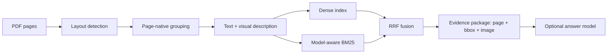

# Evidence RAG Pilot — Technical Analysis / 技术分析报告

**Snapshot date / 快照日期:** 2026-08-07
**Audience / 面向读者:** RAG engineers, document-AI researchers, and engineering knowledge-system maintainers.

## Technical summary / 技术摘要

Evidence RAG Pilot replaces token-window chunking with **page-native evidence chunks**. A chunk is a semantic region of a PDF page—such as a specification table, package drawing, feature list, or pin diagram—and retains the page number, PDF-space bounding boxes, native text, description, and evidence images needed to audit a claim.

Evidence RAG Pilot 不按固定 token 窗口切分工程文档，而是把规格表、封装图、特性列表和引脚图等页面区域组织为**版面级证据块**。每个 chunk 保留页码、PDF 坐标、文字层、语义描述和证据图，因此检索结果能够回到原始页面，而不是只返回脱离版面的文本片段。

This release is intentionally positioned as a **technical prototype and portfolio demonstration**. It explains the original design and makes its behavior inspectable; it does not claim state-of-the-art performance or superiority over Pixel RAG or other systems.

本项目的公开定位是**技术原型与个人工作演示**：重点展示原创设计、工程实现与可检查行为，不宣称达到 SOTA，也不宣称优于 Pixel RAG 或其他系统。

The current snapshot contains **182 indexed documents, 338 source pages, and 1,422 chunks** across two isolated corpora. The public Sites deployments intentionally run deterministic BM25 search without visitor API keys. The full local implementation adds a 0.6B multilingual embedding model and reciprocal-rank fusion (RRF).

**Live demonstrations:** [TXC corpus](https://evidence-rag-txc.zzkws.chatgpt.site) · [TKD corpus](https://evidence-rag-tkd.zzkws.chatgpt.site)

本次快照包含两套互相隔离的语料，共 **182 份已索引文档、338 页和 1,422 个 chunks**。公开 Sites 只运行确定性的浏览器 BM25，不要求访客提供密钥；完整本地实现再加入 0.6B 多语言 embedding 与 RRF 融合。

**在线演示：** [TXC 语料](https://evidence-rag-txc.zzkws.chatgpt.site) · [TKD 语料](https://evidence-rag-tkd.zzkws.chatgpt.site)

## The strongest result is traceability, not an unverified answer score / 当前最可靠的成果是可追溯性，而不是未经验证的问答分数

The implementation already preserves a stable evidence contract from ingestion through MCP delivery: document id, page, table-of-contents path, PDF bounding boxes, text, description, ranking diagnostics, and a merged evidence image. That makes retrieval errors inspectable and allows downstream agents to cite `[E1]`, `[E2]`, and so on against concrete page regions.

现有实现从入库、检索到 MCP 输出都保留稳定证据契约，包括文档、页码、目录路径、PDF bbox、原文、描述、排序信息和合并证据图。这使召回错误可以被定位，也让下游 agent 能把 `[E1]`、`[E2]` 等引用落到具体页面区域。

The repository previously contained 12 seed evaluation questions and 30 scenarios but no generated answer results. This release therefore publishes retrieval metrics only and makes no claim about end-to-end answer accuracy.

仓库原有 12 条 seed eval 与 30 条场景，但生成答案结果为空。因此首版只发布检索指标，不宣称端到端问答准确率。

## Corpus and metric definitions / 语料与指标定义

| Corpus | Indexed documents | Pages | Chunks | Public site mode |
|---|---:|---:|---:|---|
| TXC | 108 | 226 | 875 | Original demo UI + static snapshot |
| TKD | 74 | 112 | 547 | Original demo UI + static snapshot |
| Total | 182 | 338 | 1,422 | No visitor model key |

The public deployments retain the original four-page demo structure (`/`, `/chunks`, `/doc`, and `/chat`). All visible corpus data and evidence examples come from versioned static exports. Search and evidence-summary interactions run locally against those files and are not presented as live dense/RRF or cloud-model inference.

公开部署保留原始四页 Demo 结构（`/`、`/chunks`、`/doc`、`/chat`）。页面展示的语料数据和证据示例均来自版本化静态导出；检索与证据摘要只在本地读取这些文件，不冒充在线 dense/RRF 或云端模型推理。

Retrieval baseline definitions:

- **Recall@k:** the mean fraction of each query's annotated `gold_chunks` found in the first `k` results.
- **MRR@15:** the mean reciprocal rank of the first annotated gold chunk within the first 15 results.
- **Scored cohort:** 10 of the 12 TKD seed questions have non-empty `gold_chunks`; two unanswerable or non-gold items remain in the run but are excluded from metric denominators.
- **Query:** the original evaluation question, without a model-based rewrite.
- **Index:** existing Harrier dense vectors plus model-aware BM25, fused with `RRF_K=60`.

| TKD retrieval baseline | Result |
|---|---:|
| Scored questions | 10 |
| Recall@5 | 0.6583 |
| Recall@15 | 0.8917 |
| MRR@15 | 0.6167 |

Interpretation: the existing retriever finds most annotated evidence somewhere in the first 15 results, but early ranking still has meaningful headroom. This is a baseline for regression control, not a production-quality acceptance threshold.

解释：现有检索器能在 top 15 中找到大部分标注证据，但前排排序仍有明显优化空间。该数值用于后续回归控制，不等同于生产验收阈值。

## Model specification and operating profiles / 模型规格与运行档位

| Profile | Retrieval | Generation | Practical requirement | Intended use |
|---|---|---|---|---|
| Public Sites | Browser BM25 over exported metadata | Static, reviewed examples only | No GPU; no API key | Reliable public sharing |
| Local lite | BGE-small or Harrier | Optional/disabled | CPU, 8–16GB RAM | Development and evidence search |
| Full pipeline | Harrier 0.6B + BM25 + RRF | OpenAI-compatible multimodal model | NVIDIA GPU recommended; 32GB minimum and 48GB preferred for a 12B BF16 service | Ingestion, evaluation, full answers |

Component roles:

- **DocLayout-YOLO (~39MB locally):** detects page elements. It can run on CPU, but a GPU materially improves full-corpus processing throughput.
- **Harrier OSS 0.6B (~1.14GB weights locally):** creates 1024-dimensional multilingual embeddings. The repository downloads it by model id rather than redistributing its weights.
- **BGE-small ONNX (~63MB cache locally):** a lightweight English-oriented fallback. It is not vector-compatible with an index built by Harrier, so corpus and query embeddings must use the same backend.
- **Gemini-compatible offline VLM:** groups elements and writes descriptions. It is used during ingestion, not required for the public Sites.
- **Optional 12B multimodal answer model:** reads evidence text and images. BF16 parameters alone require roughly 24GB; runtime overhead and KV cache make 32GB a minimum planning point and 48GB the recommended single-GPU target.

The public deployment does not attempt to fit Python, sentence-transformers, or a 12B model into a serverless web worker. This is an engineering choice: the sites demonstrate the evidence contract and retrieval behavior without creating an unauthenticated model-cost endpoint.

公开部署不会尝试把 Python、sentence-transformers 或 12B 模型塞进 serverless worker。这是工程上的主动取舍：站点展示证据契约和检索行为，同时避免公开、无鉴权的模型费用入口。

## Methodology / 方法

1. Render each PDF at a controlled DPI while keeping PDF-point coordinates authoritative.
2. Detect layout elements and remove duplicate boxes with geometry-aware rules.
3. Use a VLM-assisted grouping pass with deterministic fallbacks for missing or invalid assignments.
4. Merge member crops into one evidence image per chunk without downscaling the original text.
5. Build dense and BM25 indexes from descriptions, native text, titles, keywords, and model-number-aware tokens.
6. Fuse rankings with RRF and return traceability fields alongside scores.
7. Evaluate retrieval against saved `gold_chunks`; keep answer generation outside the first release metric claim.

## Limitations and robustness / 局限与稳健性

- Scanned documents do not yet have a dedicated OCR engine. Their semantics depend primarily on the VLM description pass.
- Tables are not decomposed into cell-level structures, and continued tables are not automatically joined across pages.
- The evaluation set is small and currently TKD-focused. The reported metrics are descriptive, not statistically generalizable.
- Two seed questions lack gold chunks and are excluded from metric denominators.
- The previous ~70ms latency note had no preserved benchmark protocol and is intentionally not republished as a result.
- The public demo uses BM25 only. It labels this mode explicitly and links to the full RRF implementation rather than implying equivalence.
- Datasheet text and images may remain subject to their original publishers' terms even when this repository is authorized to redistribute the snapshot.

## Recommended next steps / 建议下一步

1. Expand the verified retrieval set to at least 100 questions, balanced across intent, language, product type, and answerability.
2. Add a dedicated OCR path for scanned datasheets and compare it against VLM-only descriptions.
3. Review Recall@5 misses before tuning fusion weights; improve early ranking without hiding missing evidence behind a larger top-k.
4. Add a separately scored answer evaluation covering citation correctness, numeric copying, evidence sufficiency, and abstention.
5. Keep the public Sites model-free until traffic and evaluation justify a rate-limited, budget-capped live model endpoint.

## Further questions / 后续问题

- Which chunk types account for most Recall@5 misses: tables, package drawings, headings, or cross-page evidence?
- Does a bilingual query-rewrite model improve Chinese engineering requests without losing exact part-number tokens?
- Can OCR improve scanned-document evidence while preserving the current bbox and image traceability contract?
- What answer-model size is sufficient once citation correctness—not generic fluency—is the primary target?

## Evidence sources / 证据来源

This report is derived from the repository snapshot, exported corpus indexes, local model artifacts, and `eval/retrieval_baseline.json`. Third-party model metadata is documented in `THIRD_PARTY_NOTICES.md`.
